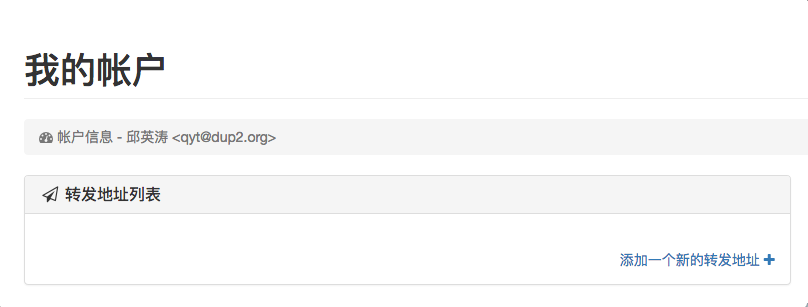
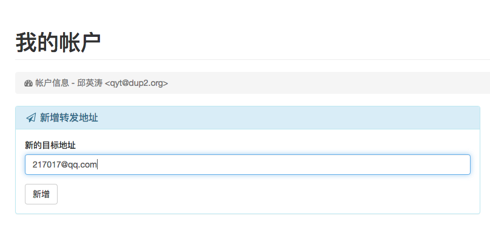
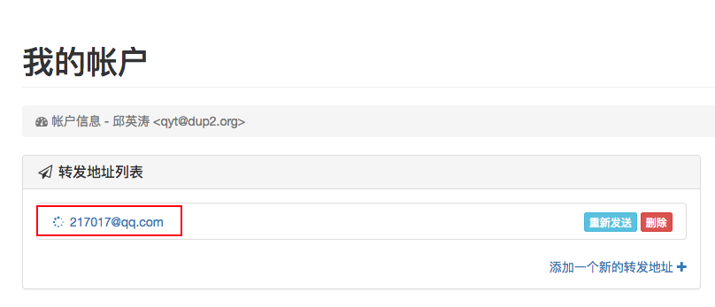
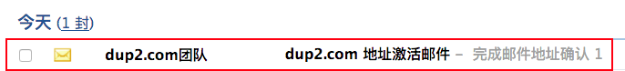
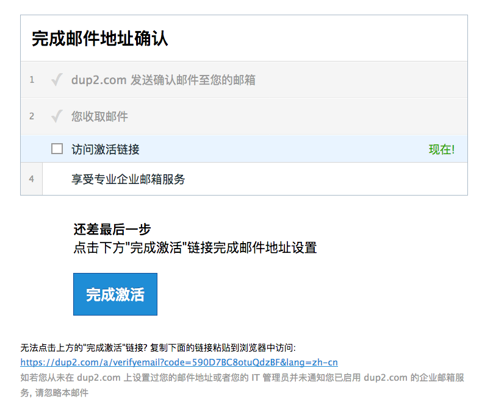
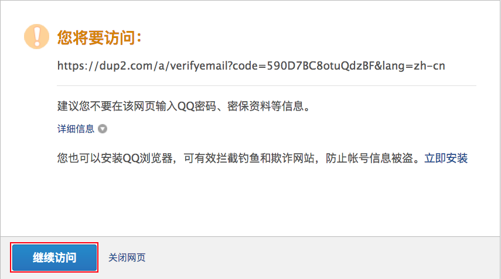
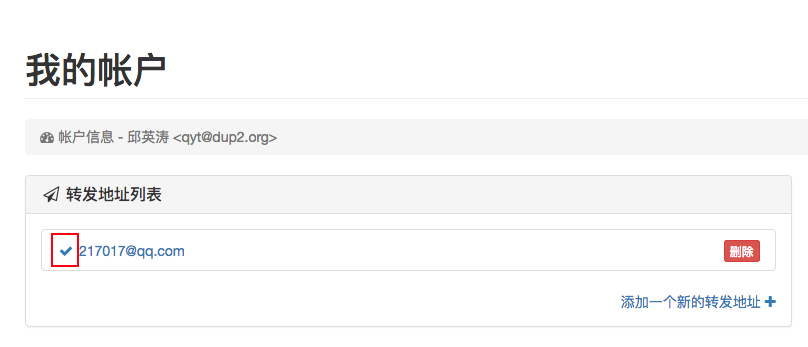

# dup2.com 的在线帮助文档

## 目录

[域管理员操作](#域管理员)

1. [域管理员帐号管理](#域管理员帐号管理)

2. [域名管理](#域名管理)

3. [邮箱帐号管理](#邮箱帐号管理)

4. [邮件组帐号管理](#邮件组帐号管理)

[普通用户操作](#普通用户)

1. [普通用户帐号管理](#普通用户帐号管理)

2. [转发地址管理](#转发地址管理)

3. [邮件投递报告](#邮件投递报告)

4. [自动答复](#自动答复)

[发信配置](#发信配置)

1. [Gmail](#gmail)

2. [Outlook](#outlook)

3. [QQ 邮箱](#qq邮箱)

4. [126 邮箱](#126邮箱)

## 域管理员

### 域管理员帐号管理

#### 注册

#### 登录

#### 找回密码

#### 修改密码

### 域名管理

### 邮箱帐号管理

### 邮件组帐号管理

#### 邮件组列表

#### 邮件组成员

## 普通用户

### 普通用户帐号管理

#### 登录

在浏览器地址栏输入 [https://www.dup2.com/a/](https://www.dup2.com/a/)

输入域管理员分配的邮箱帐号（以 qyt@dup2.org 为例）和初始密码

点【Login】按钮即能登录

#### 修改密码

### 转发地址管理

#### 新增转发地址

登录后，点击【添加一个新的转发地址+】

填写转发地址（以 217017@qq.com 为例），并点击【新增】按钮

页面刷新后，显示目前未被验证的转发地址

稍待两分钟，登录 QQ 信箱，收到一封验证信

点开信后，点击信尾的【完成激活】按钮

QQ 信箱会弹出一个警示页面，请点击【继续访问】按钮

重新登录 [https://www.dup2.com/a/](https://www.dup2.com/a/) ，能看到刚才未验证的转发地址已验证通过

然后请根据个人转发信箱的类型配置发信功能（比如转发地址是 217017@qq.com，请按照 [QQ 邮箱](#qq邮箱) 配置）

* [Gmail](#gmail)

* [Outlook](#outlook)

* [QQ 邮箱](#qq邮箱)

* [126 邮箱](#126邮箱)

#### 重新验证转发地址

#### 删除转发地址

### 邮件投递报告

### 自动答复

## 发信配置

### Gmail

### Outlook

### QQ邮箱

登录 QQ 邮箱，点击【设置】按钮

qqmail_setting.png

在邮箱设置页面中，点击【其他邮箱】链接

qqmail_other_mailbox.png

点击【添加其他邮箱帐户】按钮

qqmail_add_other_mailbox.png

输入域管理员分配的邮箱帐号（以 qyt@dup2.org 为例），并点击【下一步】按钮

qqmail_add_account.png

输入域管理员分配的邮箱帐号初始密码或自己修改后的密码，并点击【验证】按钮

qqmail_input_password.png

按下图输入POP服务器地址、POP服务器端口，并勾选“开启SSL安全连接”，然后点击【验证】按钮

qqmail_pop.png

点击【完成更多设置】

qqmail_more_setting.png

按下图选中“通过其他邮箱的SMTP服务器发送”，输入服务器(SMTP)、端口，安全类型选择“SSL”，然后点击【保存】按钮

qqmail_smtp_setting.png

待刷新完毕，页面左栏的其他邮箱下面会出现刚才配置的邮箱

qqmail_left_bar.png

为了让发到这个邮箱的信件与 QQ 邮箱的其他信件区分开，需要创建一条规则，点击【设置】按钮

qqmail_setting.png

在邮箱设置页面中，点击【收信规则】链接

qqmail_rule.png

点击【创建收信规则】按钮

qqmail_add_rule.png

按下图勾选“如果收件人“，后面输入刚配置的信箱（以 qyt@dup2.org 为例），然后勾选“邮件移动到文件夹”，后面选择刚配置的信箱（以 qyt@dup2.org 为例）

qqmail_config_rule.png

qmail_execute_rule.png

qqmail_new_mail.png

qqmail_mail_list.png

qqmail_compose.png

qqmail_reply.png

### 126邮箱
