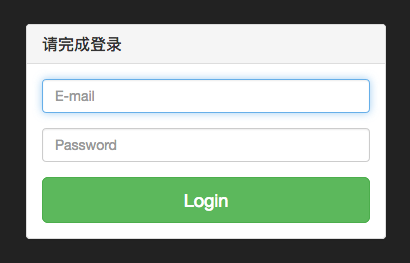
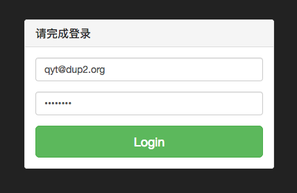

# dup2.com 的在线帮助文档

## 域管理员

### 域管理员帐号管理

#### 注册

#### 登录

#### 找回密码

#### 修改密码

### 域名管理

### 邮箱帐号管理

### 邮件组帐号管理

#### 邮件组列表

#### 邮件组成员

## 普通用户

### 普通用户帐号管理

#### 登录

在浏览器地址栏输入 [https://www.dup2.com/a/](https://www.dup2.com/a/)

输入域管理员分配的邮箱帐号（以 qyt@dup2.org 为例）和初始密码

点 Login 按钮即能登录

#### 修改密码

### 转发地址管理

### 邮件投递报告

### 自动答复
