# dup2.com 的在线帮助文档

## 目录

[域管理员操作](#域管理员)

1. [域管理员帐号管理](#域管理员帐号管理)

2. [域名管理](#域名管理)

3. [邮箱帐号管理](#邮箱帐号管理)

4. [邮件组帐号管理](#邮件组帐号管理)

[普通用户操作](#普通用户)

1. [普通用户帐号管理](#普通用户帐号管理)

2. [转发地址管理](#转发地址管理)

3. [邮件投递报告](#邮件投递报告)

4. [自动答复](#自动答复)

[发信配置](#发信配置)

1. [Gmail](#gmail)

2. [Outlook](#outlook)

3. [QQ 邮箱](#qq邮箱)

4. [126 邮箱](#126邮箱)

## 域管理员

### 域管理员帐号管理

#### 注册

#### 登录

#### 找回密码

#### 修改密码

### 域名管理

### 邮箱帐号管理

### 邮件组帐号管理

#### 邮件组列表

#### 邮件组成员

## 普通用户

### 普通用户帐号管理

#### 登录

1.在浏览器地址栏输入 [https://www.dup2.com/a/](https://www.dup2.com/a/)，回车，打开普通用户帐号配置登录页

2.输入域管理员分配的邮箱帐号（本例为 qyt@dup2.org）和密码

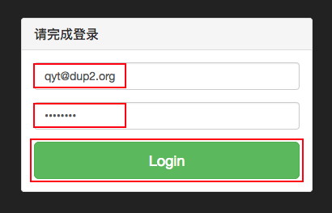

3.点【Login】按钮即能登录

#### 修改密码

1.登录后，点击左边栏【密码】链接

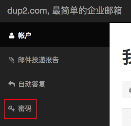

2.在更改密码页面，输入当前密码和两遍新密码，点击【修改】按钮

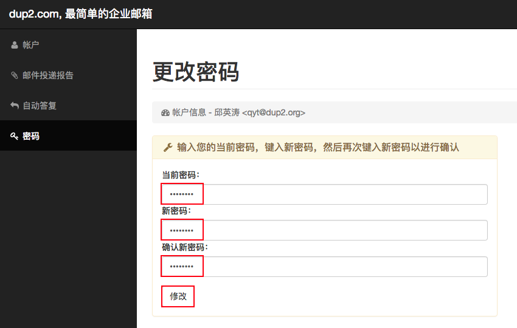

### 转发地址管理

#### 新增转发地址

1.登录后，点击【添加一个新的转发地址+】链接

2.填写转发地址（本例为 217017@qq.com），并点击【新增】按钮

3.页面刷新后，显示刚才新增且目前未被验证的转发地址（本例为 217017@qq.com）

4.稍待两分钟，登录 QQ 邮箱，收到一封验证信

5.点开信后，点击信尾的【完成激活】按钮

6.QQ 邮箱会弹出一个警示页面，请点击【继续访问】按钮

7.重新登录 [https://www.dup2.com/a/](https://www.dup2.com/a/) ，能看到刚才未验证的转发地址（本例为 217017@qq.com）已验证通过

8.然后请根据个人转发信箱的不同去各自品牌的在线邮箱配置发信功能（比如转发地址为 217017@qq.com，则按照 [QQ 邮箱](#qq邮箱) 配置）

* [Gmail](#gmail)

* [Outlook](#outlook)

* [QQ 邮箱](#qq邮箱)

* [126 邮箱](#126邮箱)

#### 重新验证转发地址

#### 删除转发地址

### 邮件投递报告

### 自动答复

## 发信配置

### Gmail

### Outlook

### QQ邮箱

1.登录 QQ 邮箱，点击【设置】按钮

2.在邮箱设置页面中，点击【其他邮箱】链接

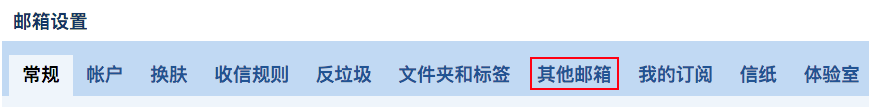

3.点击【添加其他邮箱帐户】按钮

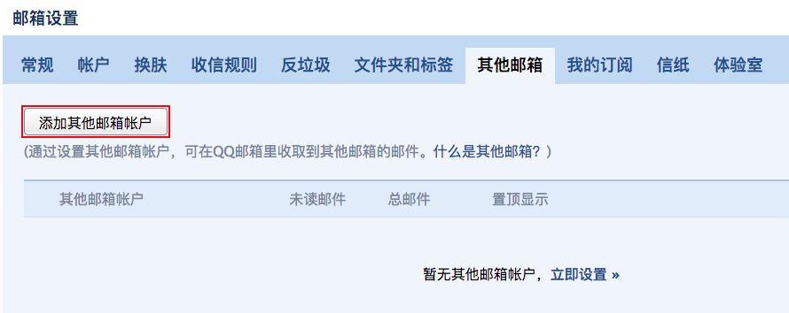

4.输入域管理员分配的邮箱帐号（本例为 qyt@dup2.org），并点击【下一步】按钮

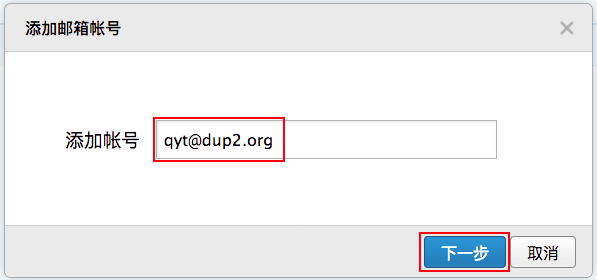

5.输入域管理员分配的邮箱帐号初始密码或自己修改后的密码，并点击【验证】按钮

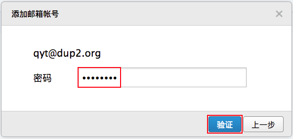

6.按下图输入POP服务器地址、POP服务器端口，并勾选“开启SSL安全连接”，然后点击【验证】按钮

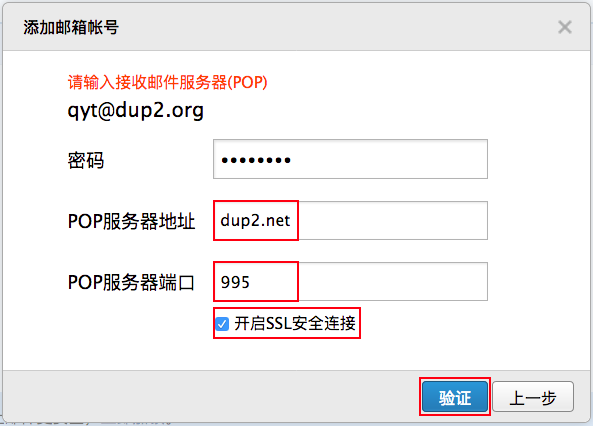

7.点击【完成更多设置】

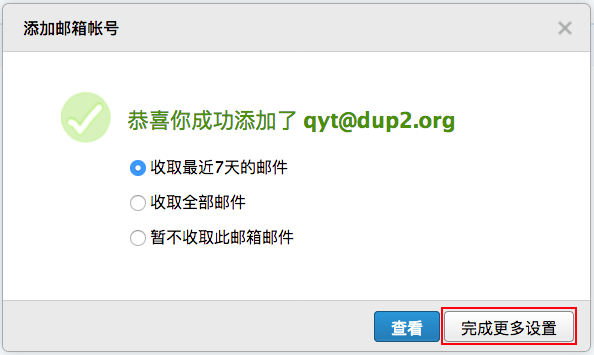

8.按下图选中“通过其他邮箱的SMTP服务器发送”，输入服务器(SMTP)、端口，安全类型选择“SSL”，然后点击【保存】按钮

9.待刷新完毕，页面左栏的其他邮箱下面会出现刚才配置的邮箱（本例为 qyt@dup2.org）

10.为了让发到这个邮箱的信件与 QQ 邮箱的其他信件区分开，需要创建一条规则，点击【设置】按钮

11.在邮箱设置页面中，点击【收信规则】链接

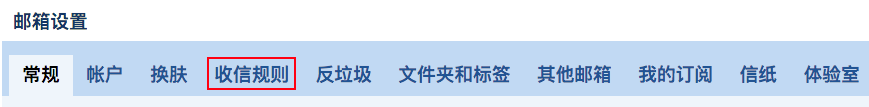

12.点击【创建收信规则】按钮

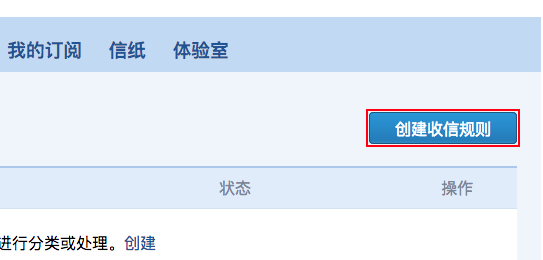

13.按下图勾选“如果收件人“，后面输入刚配置的信箱（本例为 qyt@dup2.org），然后勾选“邮件移动到文件夹”，后面选择刚配置的信箱（本例为 qyt@dup2.org），然后点击页面底部的【立即创建】按钮

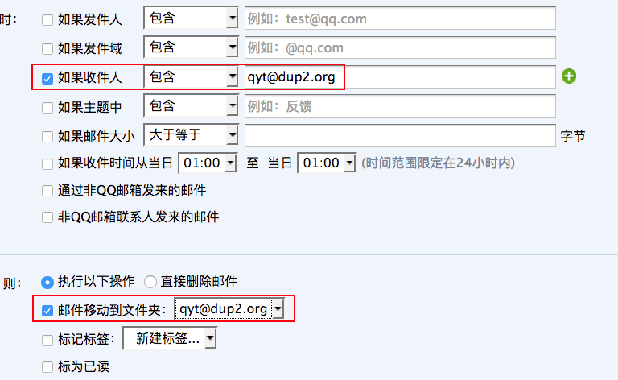

14.在下面的弹出窗口中，点击【是】按钮

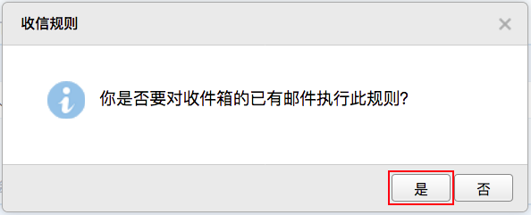

15.至此，在 QQ 邮箱里的配置完毕。下面可以测试一下，用其他邮箱给域管理员分配的邮箱发一封信（本例为 qyt@dup2.org），稍待片刻，QQ 邮箱的其他邮箱会收到这封信

16.点击邮箱后，右边的邮件列表会显示来信

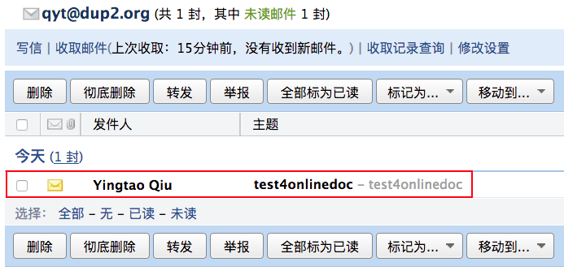

17.点击【写信】链接，可以以域管理员分配的邮箱帐号（本例为 qyt@dup2.org）写信

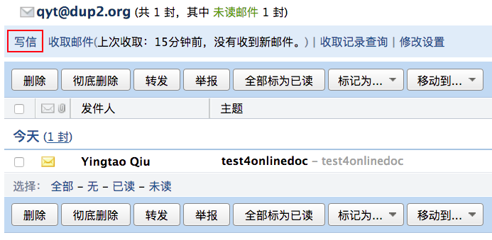

18.在查看信件内容页面里点【回复】按钮，可以以域管理员分配的邮箱帐号（本例为 qyt@dup2.org）回信

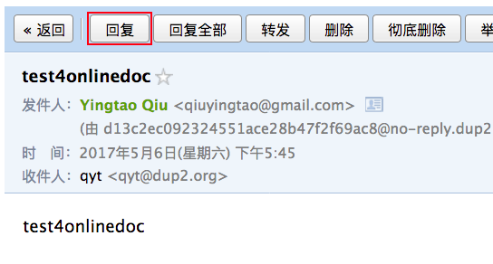

### 126邮箱
