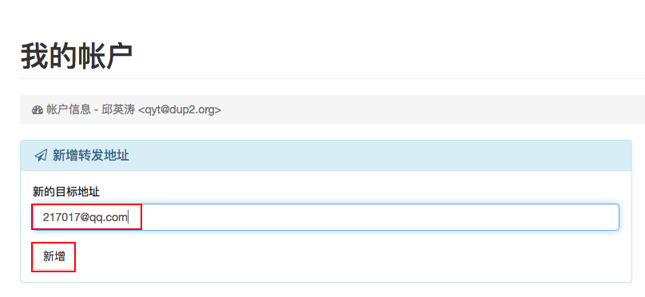
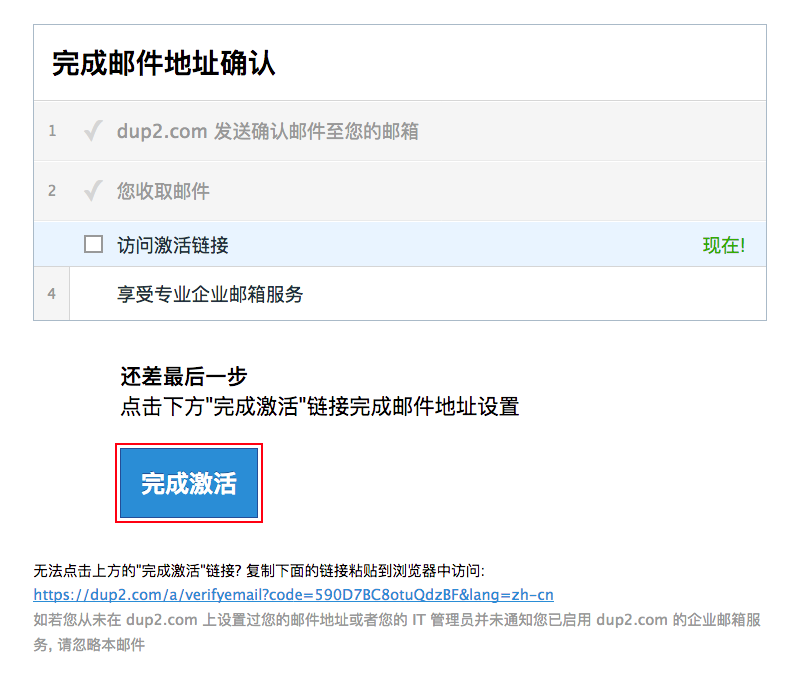

# dup2.com 的在线帮助文档

## 目录

[域管理员操作](#域管理员)

1. [域管理员帐号管理](#域管理员帐号管理)

2. [域名管理](#域名管理)

3. [邮箱帐号管理](#邮箱帐号管理)

4. [邮件组帐号管理](#邮件组帐号管理)

[普通用户操作](#普通用户)

1. [普通用户帐号管理](#普通用户帐号管理)

2. [转发地址管理](#转发地址管理)

3. [邮件投递报告](#邮件投递报告)

4. [自动答复](#自动答复)

[发信配置](#发信配置)

1. [Gmail](#gmail)

2. [Outlook](#outlook)

3. [QQ 邮箱](#QQ邮箱)

4. [126 邮箱](#126邮箱)

## 域管理员

### 域管理员帐号管理

#### 注册

#### 登录

#### 找回密码

#### 修改密码

### 域名管理

### 邮箱帐号管理

### 邮件组帐号管理

#### 邮件组列表

#### 邮件组成员

## 普通用户

### 普通用户帐号管理

#### 登录

在浏览器地址栏输入 [https://www.dup2.com/a/](https://www.dup2.com/a/)

输入域管理员分配的邮箱帐号（以 qyt@dup2.org 为例）和初始密码

点【Login】按钮即能登录

#### 修改密码

### 转发地址管理

#### 新增转发地址

登录后，点击【添加一个新的转发地址+】

填写转发地址（以 217017@qq.com 为例），并点击【新增】按钮

页面刷新后，显示目前未被验证的转发地址

稍待两分钟，登录 QQ 信箱，收到一封验证信

点开信后，点击信尾的【完成激活】按钮

QQ 信箱会弹出一个警示页面，请点击【继续访问】按钮

重新登录 [https://www.dup2.com/a/](https://www.dup2.com/a/) ，能看到刚才未验证的转发地址已验证通过

#### 重新验证转发地址

#### 删除转发地址

### 邮件投递报告

### 自动答复

## 发信配置

### Gmail

### Outlook

### QQ邮箱

### 126邮箱
